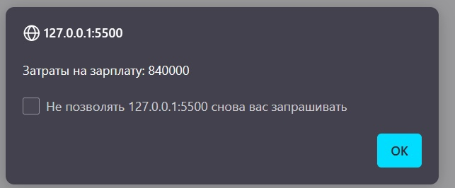

### Задание 1: level stone:
```
<!DOCTYPE html>
<html lang="en">
<head>
    <meta charset="UTF-8">
    <meta name="viewport" content="width=device-width, initial-scale=1.0">
    <title>Задание 1</title>
</head>
<body>
    <script>
var varOne = prompt('Введите первую переменную');
var varTwo = prompt('Введите вторую переменную');

if (varOne === varTwo) {
    console.log('Переменные равны');
} else {
    console.log('Переменные не равны');
}

var b = 'world';
var a = varOne + b;
    </script>
</body>
</html>
```
## Результат


### Задание 2: level iron:

```
<!DOCTYPE html>
<html lang="en">
<head>
    <meta charset="UTF-8">
    <meta name="viewport" content="width=device-width, initial-scale=1.0">
    <title>Задание 1</title>
</head>
<body>
    <script>
var fruits = ['Яблоко', 'Клубника', 'Черника', 'Малина', 'Лимон'];

for (var i = 0; i < fruits.length; i++) {
    console.log(fruits[i]);
    switch (fruits[i]) {
        case 'Яблоко':
            console.log('Зеленое яблоко');
            break;
        case 'Клубника':
            console.log('Красная клубника');
            break;
        case 'Черника':
            console.log('Синяя черника');
            break;
        case 'Малина':
            console.log('Светло-красная малина');
            break;
        case 'Лимон':
            console.log('Желтый лимон');
            break;
        default:
            console.log('Неизвестный фрукт');
    }
}
    </script>
</body>
</html>
```

## Результат


### Задание 3: level gold

```
<!DOCTYPE html>
<html lang="en">
<head>
    <meta charset="UTF-8">
    <meta name="viewport" content="width=device-width, initial-scale=1.0">
    <title>Задание 1</title>
</head>
<body>
    <script>
var numberOfEmployees;
do {
    var input = prompt('Введите количество сотрудников', undefined);
    numberOfEmployees = parseFloat(input);
} while (isNaN(numberOfEmployees) || numberOfEmployees === 0);

var salaryPerEmployee;
do {
    var input = prompt('Введите зарплату на одного сотрудника', undefined);
    salaryPerEmployee = parseFloat(input);
} while (isNaN(salaryPerEmployee) || salaryPerEmployee === 0);

var totalCost = numberOfEmployees * salaryPerEmployee;
alert('Затраты на зарплату: ' + totalCost);
    </script>
</body>
</html>
```

## Результат





### Задание 4
```
<!DOCTYPE html>
<html lang="en">
<head>
    <meta charset="UTF-8">
    <meta name="viewport" content="width=device-width, initial-scale=1.0">
    <title></title>
</head>
<body>
    <script>
var students = [
    { FIO: 'Петров А.А.', Ocenka: 5 },
    { FIO: 'Иванов Б.Б.', Ocenka: 3.4 },
    { FIO: 'Сидоров Г.Г.', Ocenka: 9 },
    { FIO: 'Смирнов Д.Д', Ocenka: 2 },
    { FIO: 'Молодой Е.Е', Ocenka: 3.4 }
];

var sum = 0;
var count = 0;
var poorStudents = [];

for (var i = 0; i < students.length; i++) {
    var student = students[i];
    var grade = student.Ocenka;

    if (grade < 0 || grade > 5) {
        console.log('Оценка для студента ' + student.FIO + 'не соответствует допустимым значениям');
        continue;
    }

    if (grade < 4) {
        poorStudents.push(student);
    }

    sum += grade;
    count++;
}

if (count > 0) {
    var averageGrade = sum / count;
    console.log('Средняя оценка: ' + averageGrade);
} else {
    console.log('Нет оценок для учета');
}

console.log('Плохие студенты:');
if (poorStudents.length === 0) {
    console.log('Таких нет');
} else {
    poorStudents.forEach(function (student) {
        console.log('ФИО: ' + student.FIO + '; Оценка: ' + student.Ocenka);
    });
}
    </script>
</body>
</html>
```

## Результат 

